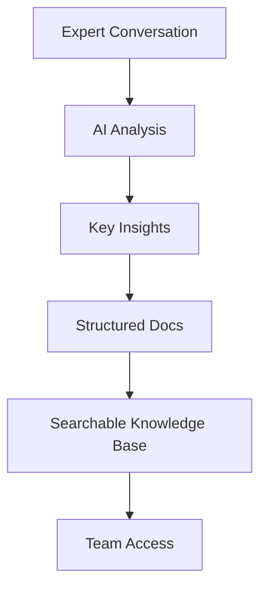

## What is Tacivo?

Tacivo helps you capture expert knowledge through natural AI conversations. You converse with experts, and Tacivo transforms those discussions into structured, searchable documentation. This creates institutional memory that grows over time, turning tacit expertise into a lasting asset for your organization.

You build a competitive moat by converting fleeting conversations into AI-ready knowledge bases. Access insights instantly, onboard teams faster, and scale expertise without losing context.

## Key Features

<Columns cols={3}>
  <Card title="AI Conversations" icon="message-circle" href="/docs/conversations">
    Engage experts in natural dialogue. Tacivo extracts key insights automatically.
  </Card>
  <Card title="Structured Docs" icon="file-text" href="/docs/documentation">
    Generate Markdown, APIs, and searchable indexes from every interaction.
  </Card>
  <Card title="Searchable Memory" icon="search" href="/docs/search">
    Query your knowledge base with AI-powered semantic search.
  </Card>
</Columns>

## How Tacivo Captures Tacit Expertise

Tacivo uses AI to distill conversations into actionable documentation. Follow these steps to get started:

<Steps>
  <Step title="Start a Conversation" icon="message-circle">
    Invite an expert to chat. Tacivo records and analyzes the discussion in real-time.
  </Step>
  <Step title="Extract Insights" icon="zap">
    AI identifies key concepts, processes, and decisions automatically.
  </Step>
  <Step title="Generate Docs" icon="file">
    Output structured MDX pages, code snippets, and diagrams ready for your docs site.
  </Step>
  <Step title="Search and Share" icon="share-2">
    Index everything for instant access across your team.
  </Step>
</Steps>



## Benefits for Your Organization

<Callout kind="success">
  Organizations using Tacivo report 40% faster onboarding and reduced knowledge silos.
</Callout>

<Tabs>
  <Tab title="Startups" icon="sparkles">
    Scale expertise without hiring delays. Turn founder knowledge into docs that compound.
  </Tab>
  <Tab title="Enterprises" icon="building">
    Preserve institutional memory across teams. Comply with knowledge retention policies.
  </Tab>
  <Tab title="Consulting Firms" icon="users">
    Package client expertise into reusable assets. Accelerate project delivery.
  </Tab>
</Tabs>

## Integrate Tacivo into Your Stack

Embed Tacivo in your documentation workflow with simple SDK integration.

<CodeGroup tabs="JavaScript,Python">
  ```javascript
  import { Tacivo } from '@tacivo/sdk';

  const tacivo = new Tacivo({ apiKey: 'YOUR_API_KEY' });

  async function captureKnowledge(conversation) {
    const docs = await tacivo.process(conversation);
    console.log(docs);
  }
  ```
  ```python
  from tacivo import Tacivo

  tacivo = Tacivo(api_key="YOUR_API_KEY")

  def capture_knowledge(conversation):
      docs = tacivo.process(conversation)
      print(docs)
  ```
</CodeGroup>

## Building Your Competitive Moat

<Expandable title="Why Tacivo Creates Lasting Advantage" default-open="true">
  Tacivo compounds knowledge daily. Each conversation adds to your moat:

  | Benefit              | Impact                          |
  |----------------------|---------------------------------|
  | Reduced Silos        | Teams access shared expertise   |
  | Faster Onboarding    | New hires productive in days    |
  | AI-Ready Data        | Fuel LLMs with clean knowledge  |
  | Retention Compliance | Audit-ready knowledge trails    |

  Scale without losing what makes your company unique.
</Expandable>

<Callout kind="tip">
  Start with a single expert session to see immediate value. Visit `/docs/quickstart` next.
</Callout>