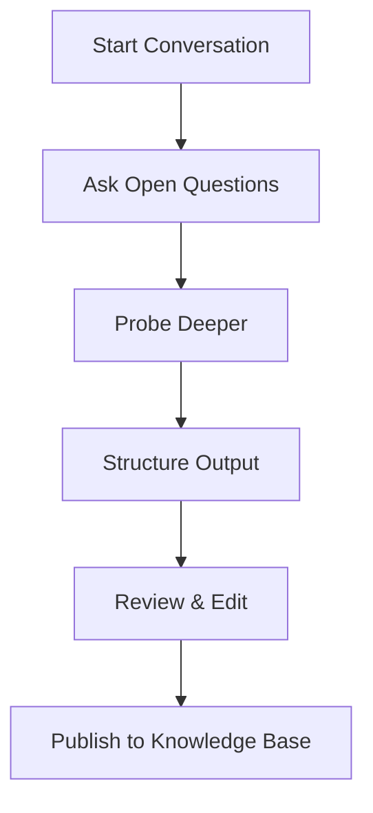

## Overview

Tacivo helps you capture expert knowledge through structured AI conversations. You transform tacit expertise into institutional memory by asking targeted questions, refining responses, and organizing outputs into searchable formats. This process creates a competitive moat, turning fleeting insights into compounding assets.

<Columns cols={3}>
  <Card title="Effective Conversations" icon="message-circle" href="#conducting-effective-conversations">
    Guide experts with precise prompts to elicit detailed responses.
  </Card>
  <Card title="Structured Outputs" icon="database" href="#structuring-outputs">
    Convert raw insights into JSON, Markdown, or database-ready schemas.
  </Card>
  <Card title="Review and Edit" icon="edit-3" href="#reviewing-and-editing">
    Iterate collaboratively to ensure accuracy and completeness.
  </Card>
</Columns>

## Conducting Effective Conversations

Follow these steps to run productive AI sessions with domain experts.

<Steps>
  <Step title="Prepare Your Prompts" icon="edit">
    Define clear objectives. Focus on one topic per conversation, such as "Explain the customer onboarding process step-by-step."

    <Callout kind="tip">
      Start with open-ended questions like "Walk me through your daily workflow" to uncover hidden knowledge.
    </Callout>
  </Step>
  <Step title="Engage the Expert" icon="user">
    Record the conversation in real-time. Probe deeper with follow-ups: "Why do you prefer this approach over alternatives?"
  </Step>
  <Step title="Capture Raw Insights" icon="file-text">
    Transcribe responses immediately. Note non-verbal cues or examples provided.
  </Step>
</Steps>

## Structuring Outputs

Organize conversation transcripts into structured formats for AI consumption and searchability. Use these patterns to standardize knowledge.

<Tabs>
  <Tab title="JSON Schema" icon="code">
    Structure insights as key-value objects for database ingestion.

    <CodeGroup tabs="Prompt,Output">
```prompt
Extract the onboarding process from this transcript and output as JSON with fields: steps (array), prerequisites (array), common_pitfalls (array).
```

````json
{
  "steps": [
    "Verify user email",
    "Send welcome kit",
    "Assign initial tasks"
  ],
  "prerequisites": ["Account approval"],
  "common_pitfalls": ["Skipping email verification"]
}
````
    </CodeGroup>
  </Tab>
  <Tab title="Markdown Documentation" icon="file">
    Generate readable docs with sections for quick reference.

    ```markdown
# Customer Onboarding

## Steps
1. Verify email
2. Send welcome materials

## Pitfalls
- Forgetting verification leads to support tickets.
    ```
  </Tab>
</Tabs>

## Reviewing and Editing Knowledge

Validate structured outputs to maintain quality.

<ExpandableGroup>
  <Expandable title="Review Checklist" default-open="true">
    - Accuracy: Does it match the original conversation?
    - Completeness: Are edge cases covered?
    - Clarity: Is it concise yet detailed?
    - Searchability: Include keywords experts use, like `onboarding pitfalls`.
  </Expandable>
  <Expandable title="Editing Workflow">
    Use collaborative tools to iterate. Tag experts for feedback on specific sections.
  </Expandable>
</ExpandableGroup>

<Callout kind="alert">
  Always version your knowledge base. Track changes to see how expertise evolves.
</Callout>

## Best Practices for Experts

Follow these guidelines to maximize value.

| Practice | Description | Benefit |
|----------|-------------|---------|
| Be Specific | Use real examples from past projects | Increases applicability |
| Think Aloud | Verbalize decision-making process | Reveals tacit reasoning |
| Cover Edge Cases | Discuss failures and workarounds | Builds robust documentation |
| Iterate | Review drafts and refine | Ensures precision |



This workflow ensures your Tacivo knowledge compounds over time, creating searchable, AI-ready assets that drive efficiency.